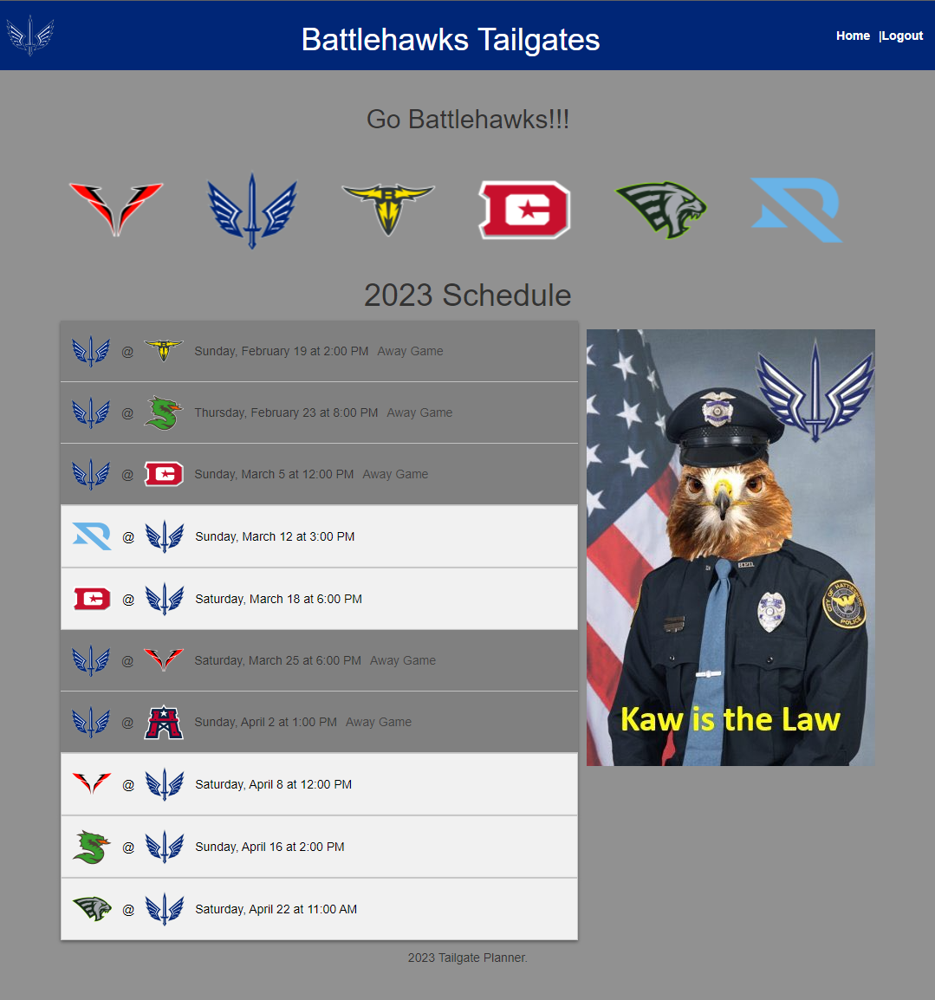

# BattleHawks Tailgate

## Visuals

## Description

Battlehawks Tailgates is a platform designed for people to sign up for tailgates at the Dome for Battlehawks games. It has been the brain child of Wasif Mahmood, Stephen Bondurant, and Cheryl Miller.  It aims to create a community of tailgaters and provide them with a convenient platform to interact, organize, and sign up for various duties related to the tailgating experience.
The motivation behind developing this app is to enhance the overall tailgating experience for Battlehawks fans. By providing a centralized platform for signing up and organizing tailgates, the app aims to streamline the process, increase engagement, and foster a sense of community among tailgaters.

## Table of Contents
- [BattleHawks Tailgate](#battlehawks-tailgate)
  - [Visuals](#visuals)
  - [Description](#description)
  - [Table of Contents](#table-of-contents)
  - [Usage](#usage)
  - [Repo](#repo)
  - [License](#license)
  - [Contributors](#contributors)

## Usage

 [Click here](https://infinite-savannah-06208.herokuapp.com/) to be directed to our working application.

## Repo

Link to the application's repo: [Battlehawks Tailgate](https://github.com/mahmoo30/BattleHawksTailgate)

## License
MIT
## Contributors

[mahmoo30](https://github.com/mahmoo30)  
[Steveb175](https://github.com/Steveb175)  
[SmilieKay](https://github.com/SmilieKay)  

If you have any questions, please contact any of the contributors of this application.
